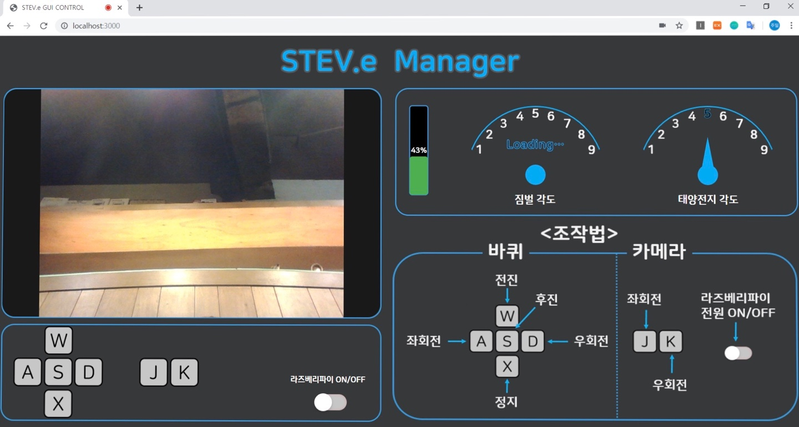

# 2019 HANIUM contest
## Team name: STEV.e (SolarTracking Mapping Robot)

Code to control the robot.

Frontend code: GUI robot controller made by JS, CSS, HTML.

Backend code: build a server to communicate server-to-MCU and server-to-browser.

